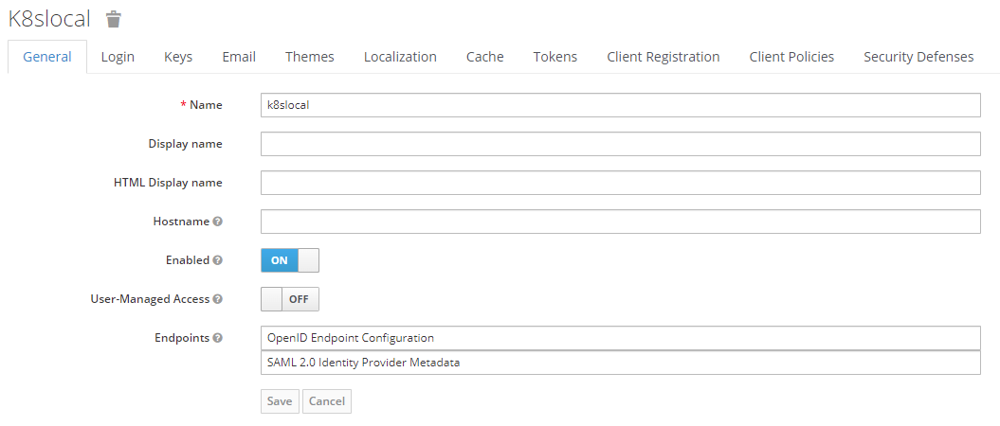
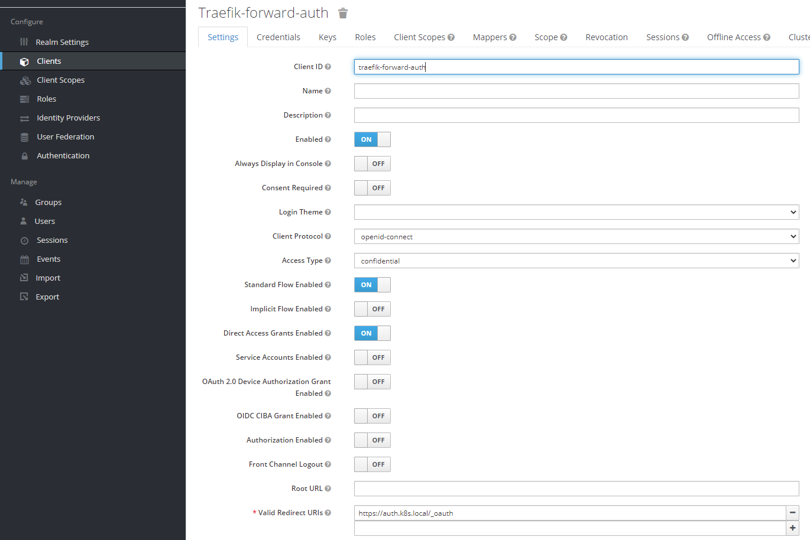

# Traefik Keycloak

## Create self-signed certificates

```powershell
Copy-Item $env:LOCALAPPDATA/mkcert/rootCA.pem ./data/certs/cacerts.crt
Copy-Item $env:LOCALAPPDATA/mkcert/rootCA-key.pem ./data/certs/cacerts.key

cd ./data/certs
mkcert k8s.local '*.k8s.local' localhost 127.0.0.1 ::1
```

## Update DNS

Add the following entries to your hosts (`C:\Windows\System32\drivers\etc\hosts` or `/etc/hosts`) file:

```text
127.0.0.1 k8s.local traefik.k8s.local
127.0.0.1 whoami1.k8s.local whoami2.k8s.local
127.0.0.1 keycloak.k8s.local auth.k8s.local
```

## Start environment

```powershell
docker-compose up -d
```

## Configure keycloak

### Create a client

Create a realm `k8s.local` to operate in.


Then create a client for `traefik-forward-auth` in that realm



Capture the Client Secret, store it in the `.env` file and re-apply the docker-compose config.

Also create a user to login with.
